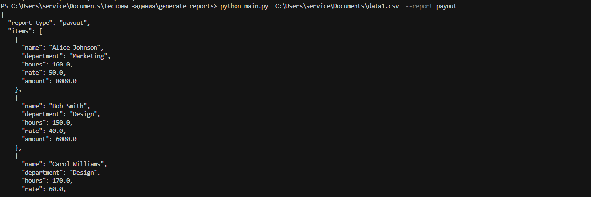
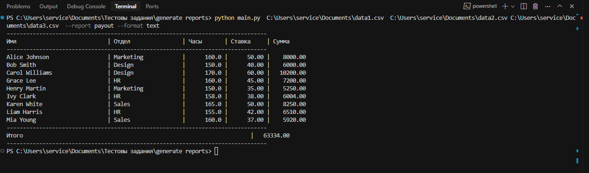
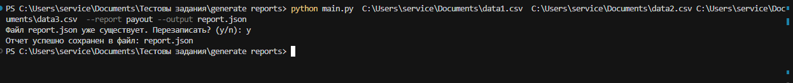

# Генератор отчетов по данным сотрудников

Данный скрипт читает данные сотрудников из CSV файлов и формирует отчеты различных типов в разных форматах вывода.


## Требования

- Python 3.6+
- Для запуска тестов: pytest, pytest-cov


## Установка

```bash
pip install -r requirements.txt
```


## Использование

### Генерация отчета по заработной плате

```bash
python main.py data1.csv data2.csv data3.csv --report payout
```

Параметры:
- Список CSV файлов с данными сотрудников
- `--report` - тип отчета
- `--format` - формат вывода (поддерживается `json` (по умолчанию) и `text`)
- `--output` - путь к файлу для сохранения результата (если не указан, результат выводится в консоль)

### Примеры использования

Вывод отчета в консоль в формате JSON:
```bash
python main.py data1.csv data2.csv data3.csv --report payout
```



Вывод отчета в консоль в текстовом формате:
```bash
python main.py data1.csv data2.csv data3.csv --report payout --format text
```



Сохранение отчета в JSON-файл:
```bash
python main.py data1.csv data2.csv data3.csv --report payout --output report.json
```




Сохранение отчета в текстовый файл:
```bash
python main.py data1.csv data2.csv data3.csv --report payout --format text --output report.txt
```


## Структура проекта

```
├── main.py                      # Основной файл для запуска скрипта
├── README.md                    # Документация проекта
├── run_tests.py                 # Скрипт для запуска тестов
├── src/                         # Исходный код
│   ├── __init__.py
│   ├── reports/                 # Модули для генерации отчетов
│   │   ├── __init__.py
│   │   ├── formatters.py        # Форматеры для вывода отчетов
│   │   └── report_generator.py  # Классы генераторов отчетов
│   └── utils/                   # Утилиты
│       ├── __init__.py
│       └── csv_reader.py        # Класс для чтения CSV файлов
```

## Архитектура

Программа имеет модульную архитектуру, которая позволяет легко добавлять новые типы отчетов и форматы вывода.

Основные компоненты:
- `CSVReader` - класс для чтения данных из CSV файлов
- `ReportGenerator` - абстрактный базовый класс для генераторов отчетов
- `PayoutReportGenerator` - класс для генерации отчетов по заработной плате
- `ReportFactory` - фабрика для создания генераторов отчетов
- `ReportFormatter` - абстрактный базовый класс для форматеров отчетов
- `JsonFormatter` - класс для JSON форматирования отчетов
- `FormatterFactory` - фабрика для создания форматеров отчетов

### Добавление нового типа отчета

Для добавления нового типа отчета необходимо:

1. Создать новый класс-наследник от `ReportGenerator` в модуле `src/reports/`
2. Реализовать метод `generate`, который возвращает словарь с данными отчета
3. Зарегистрировать новый класс в фабрике `ReportFactory`

Пример:

```python
from src.reports.report_generator import ReportGenerator, ReportFactory

class HourlyRateByDepartmentReportGenerator(ReportGenerator):
    def generate(self, employees_data):
        # Логика генерации отчета
        return {
            'report_type': 'hourly_rate_by_department',
            'items': [...],  # результаты по отделам
            'total': 0.0  # общее значение
        }

# Регистрация нового генератора
ReportFactory.register_generator('hourly_rate_by_department', HourlyRateByDepartmentReportGenerator)
```

### Добавление нового формата вывода

Для добавления нового формата вывода необходимо:

1. Создать новый класс-наследник от `ReportFormatter` в модуле `src/reports/formatters.py`
2. Реализовать метод `format`, который преобразует данные отчета в нужный формат
3. Зарегистрировать новый класс в фабрике `FormatterFactory`

Пример:

```python
from src.reports.formatters import ReportFormatter, FormatterFactory

class XmlFormatter(ReportFormatter):
    def format(self, data):
        # Логика форматирования данных в XML
        return xml_string

# Регистрация нового форматера
FormatterFactory.register_formatter('xml', XmlFormatter)
```

### Обработка ошибок

Программа включает расширенную обработку ошибок:
- Проверка существования и формата входных файлов
- Проверка корректности типа отчета
- Проверка корректности формата вывода
- Обработка ошибок при чтении данных
- Обработка ошибок при генерации и форматировании отчета